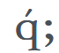
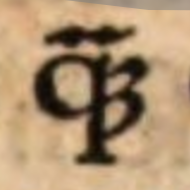
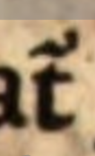

## 16th Century Exegesis of Paul

# Website 

* Website : https://16thexegesisdh.github.io/ReformingPaul/

# Project

The digital component of the project on the exegesis of Paul aims to build up a corpus of commentaries dating from the 16th century.

This digital corpus will make it possible to develop specific textual analysis tools for texts in Latin from the 16th century and models for the automatic processing of printed material in Latin from this period. A major digital dimension is therefore planned for this project, with the digitisation of a large number of printed documents on the one hand and the computational exploitation of this data on the other, in particular using the distant reading et the topic modeling.

* Website : https://16thexegesisdh.github.io/ReformingPaul/
* Project GitHub: https://github.com/16thExegesisDH

## Funder

This project is funded by the Swiss National Science Foundation (SNSF). Project number : [207696](https://data.snf.ch/grants/grant/207696)

# Table of Contents
-Data
-Corpus 
-Guideline 
[I. Guideline for Segmentation](#i-guideline-for-segmentation)  
[II. Guideline for Transcription](#ii-guideline-for-transcription)  
[ III. Encoding Problem](#iii-encoding-problem) 
-Citations 

## Data 
** Corpus HTR et Segmentation ** 
* 2026 : []() digital library corpus, 
* 2025 : [HTR_1-Timotheus](https://github.com/16thExegesisDH/HTR_1-Timotheus) (Roman characters) :  Contains the best dataset :white_check_mark:
        - Commentaries on Timotheus and PHD students dataset `_test`
* 2024 : [HTR_Lambertus_prototype](https://github.com/FourbeFlo/Lambertus) (Roman characters) :
         _the beta-test corpus 2023-2024, more information on https://github.com/FourbeFlo/Lambertus_, data now uploeded with a new 

  
## Corpus 

the corpus complete is avalaible in the HTR_Paul_corpus repository

[corpus : 7-10-24](https://github.com/16thExegesisDH/HTR_beta_corpus_2023/blob/main/corpus_ocr.csv)


# GuideLine 

* the Guideline for segmentation and transcription are available in the following [Readme](https://github.com/16thExegesisDH/HTR_Paul_corpus/blob/main/README.md)

# I. Guideline for Segmentation

The main documentation  is here: [Annotation Guide on GitHub](https://github.com/DEFI-COLaF/LADaS/blob/main/AnnotationGuide.md).

## Examples of Specific Cases in Our Corpus

### Legend
- **RunningTitleZone**: pink
- **MainZone:Head**: yellow
- **MainZone:P**: dark green
- **MainZone:P#Continued**: light blue
- **NumberingZone**: rosa (specific examples provided)
- **DropCapitalZone**: dark viola
- **QuireMarkZone**: viola
- **MainZone-ListItem**: brown
- **MarginTextZone-ManuscriptAddendum**: red

### Examples

| Description | Example |
| -------- | ------- |
| **RunningTitleZone**: pink <br/> **MainZone:Head**: yellow <br/> **MainZone:P**: dark green <br/> **MainZone:P#Continued**: light blue <br/> **NumberingZone**: rosa for "section 12" and "102" <br/> **QuireMarkZone**: viola |  |
| **RunningTitleZone**: pink <br/> **DropCapitalZone**: dark viola <br/> **MainZone:Head**: yellow <br/> **MainZone:P**: dark green <br/> **MainZone:P#Continued**: light blue <br/> **NumberingZone**: rosa for "456", "II", "III" <br/> **QuireMarkZone**: viola |  |
| **RunningTitleZone**: pink for "VII" (Epistle number) and "Col" (Epistle name) <br/> **MainZone:Head**: yellow <br/> **MainZone:P**: dark green <br/> **MainZone:P#Continued**: light blue <br/> **NumberingZone**: rosa for "7", "8", "184" |  |
| **RunningTitleZone**: pink for "COM" <br/> **DropCapitalZone**: dark viola <br/> **MainZone:Head**: yellow <br/> **MainZone:P**: dark green <br/> **MainZone:P#Continued**: light blue <br/> **NumberingZone**: rosa for "1", "C4", "D4", "5", "6" |  |
| **RunningTitleZone**: pink <br/> **MainZone-ListItem** brown for "II ad liberalitatem [...] etc"<br> **MainZone:Head**: yellow <br/> **MainZone:P**: green <br> **NumberingZone**: rosa <br> **QuireMarkZone**: viola |  |
| **TitlePageZone**: light light viola <br/> **MarginTextZone-ManuscriptAddendum**: red <br> _for the manuscript annotation around the text_ <br> |  |


# II. Guideline for Transcription

We follow, as much as possible, the transcription standards proposed by [Catmus standard](https://catmus-guidelines.github.io):

**Citation:**

Ariane Pinche, Thibault Clérice, Alix Chagué, Jean-Baptiste Camps, Malamatenia Vlachou-Efstathiou, et al., *CATMuS-Medieval: Consistent Approaches to Transcribing ManuScripts: A generalized set of guidelines and models for Latin scripts from Middle Ages (8th–16th century)*. 2023. [hal-04346939](https://hal.archives-ouvertes.fr/hal-04346939).

## Special Cases

* Special cases are documented in the examples below. The relevant letters or signs are encoded in **Junicode** and added to the [_exegesis_ keyboard](keyboard/exegesis.json).
* Greek text is fully transcribed and edited without preserving any abbreviations or ligatures.
* Hebrew letters may appear in the data but are not corrected as of now (19.02.2025).

## Tools for Building the Transcription

* **Download the keyboard for special letters:** /
  - If a letter is not already included in the keyboard, take a screenshot and store the image in `pictures/mysteria_litterae`.
* **Greek Transcription:**
  - Greek is transcribed fully.
  - Issues related to transcribing ligatures can be resolved using:
    - [Greek_Abbreviations.pdf](Greek_Abbreviations.pdf)
    - [_Alphabetum Graecum_ by Theodore de Bèze](https://doi.org/10.3931/e-rara-6065), see vignettes 27-39.

## Examples of Special Cases

| **Sign**             | **Example**                                                                                          | **Source**                                  | **Transcription** | **Unicode/Junicode** |
|----------------------|-----------------------------------------------------------------------------------------------------|--------------------------------------------|-------------------|----------------|
| Pilcrow              |  | [e-rara, p.11](https://doi.org/10.3931/e-rara-6338) | ¶                 | `U+00B6` |
| Semicolon (shaped)   |  | |  | q `U+0071` + acute `U+0301` <br> Junicode (`F1AC`) |
| Cumque Abbreviation |  | |  | Junicode (`00E8BF`) + tilde (`000303`) |
| Tur Abbreviation  |  | |  | Junicode (`000303`) + t Unicode |

## Citation : Project

Ueli Zahnd, Stefan Krauter, Matteo Colombo, Floriane Goy, Benjamin Manig, Noemi Schürmann,  _16th Century Exegesis of Paul_, Geneva ; Zürich, Universities of Geneva and Zürich, 2023.

```bibtex
@misc{Goy_exegesisofPaul_2023,
  author={Ueli Zahnd, Stefan Krauter, Matteo Colombo, Floriane Goy, Benjamin Manig, Noemi Schürmann},
  title={16th Century Exegesis of Paul},
  address={Geneva; Zürich},
  publisher={Univesity of Geneva; University of Zürich},
  year={2023},
  url={https://www.theologie.uzh.ch/de/faecher/neues-testament/Professur-f%C3%BCr-neutestamentliche-Wissenschaft/16th_century_exegesis_of_paul.html},
  note={Grant number SNFS : 207696},
}
```
## On the project

-  Reformation Readings of Paul : [RRP](https://rrp.zahnd.be/) : database for the 16th century printed commentaries on Paul.
-  in Zürich [exegesis of Paul](https://www.theologie.uzh.ch/de/faecher/neues-testament/Professur-f%C3%BCr-neutestamentliche-Wissenschaft/16th_century_exegesis_of_paul.html) and Geneva [l'exégèse des épîtres pauliniennes](https://www.unige.ch/ihr/fr/accueil/exegese-paulinienne/)
