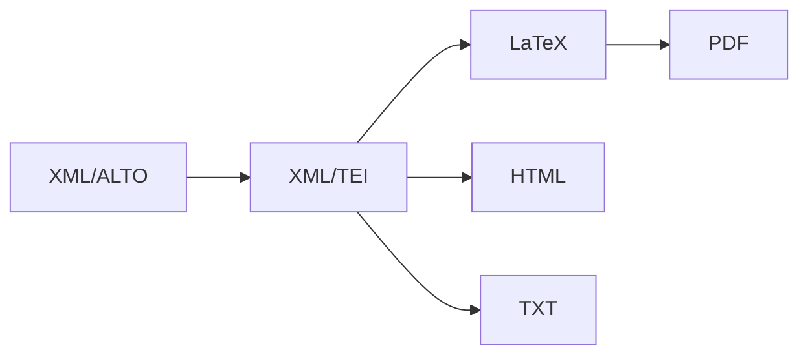

## 16th Century Exegesis of Paul

# Website 

* Website: https://16thexegesisdh.github.io/ReformingPaul/ 
* Migration to TEI Publisher scheduled for **summer 2026**

# Project

The digital component of the project on the exegesis of Paul aims to build up a corpus of commentaries dating from the 16th century.

This digital corpus will make it possible to develop specific textual analysis tools for **printed texts in Latin from the 16th century** and models for the automatic processing of printed material in Latin from this period. A major digital dimension is therefore planned for this project, with the digitisation of a large number of printed documents on the one hand and the computational exploitation of this data on the other, in particular using distant reading and topic modeling.


## Funder

This project is funded by the Swiss National Science Foundation (SNSF). Project number: [207696](https://data.snf.ch/grants/grant/207696)

# Table of Contents

- [Data](#data)
- [Corpus](#corpus)
- [Models](#Models)
- [Workflow](#Workflow)
  - [I. Processing Pipeline](#i-processing-pipeline)
  - [II. Web Application: TEI Publisher](#ii-web-application-tei-publisher)
- [Guidelines](#guidelines)
  - [I. Segmentation](#i-segmentation)
  - [II. Transcription](#ii-transcription)
- [Documentations](#Documentations)
- [Project Timeline](#project-timeline)
- [Citations](#citations)

---


## Data 

 The following repositories contain the XML-TEI texts from the 16th Century Exegesis of Paul projet. 
 
* **TEI**
  
   - [Tei-16th-Exegesis](https://github.com/16thExegesisDH/TEI-16th-Exegesis)

---

 The following repositories contain the HTR texts from the 16th Century Exegesis of Paul projet. 
 
* **HTR**
  
   - [HTR-Corpus-A](https://github.com/16thExegesisDH/HTR-Corpus-A)
   - [HTR-Corpus-B](https://github.com/16thExegesisDH/HTR-Corpus-B)
   - [HTR-Corpus-C](https://github.com/16thExegesisDH/HTR-Corpus-C)

---

## Corpus 

| Corpus | Description | File |
|--------|-------------|------|
| **Corpus A** | Gold-standard corpus, manually corrected; used as a training dataset for the models.| [Corpus_A.csv](https://github.com/16thExegesisDH/HTR-Corpus-A/blob/main/corpus/Corpus_A.csv) |
| **Corpus B** | Bronze-standard corpus, automatically corrected; manual corrections limited to verses OCR. | [Corpus_B.csv](https://github.com/16thExegesisDH/HTR-Corpus-B/blob/main/corpus/Corpus_B.csv) |
| **Corpus C** | Silver-standard corpus; reviewed segmentation, corrected verses-level OCR | [Corpus_C.csv](https://github.com/16thExegesisDH/HTR-Corpus-C/blob/main/corpus/Corpus_C.csv) |

---

## Models 

* **Layout Analysis:**
  - [Repository – Segmentation-model](https://github.com/16thExegesisDH/Segmentation_model)
  - Our model _Layout-16th-Print-Lat_ available on zenodo :[18492102](https://doi.org/10.5281/zenodo.18492102)
* **HTR:** 
  - Best model currently available (trained by colleagues on a subset of our data; link forthcoming)
  - Old model trained for the project:
    * [Reposoitory – OCR](https://github.com/FourbeFlo/OCR_test)
    - old model (25.06.2024): [Download](https://github.com/FourbeFlo/OCR_test/releases/download/ml.model/lambertus_test_mai_best.mlmodel)

---

## Workflow

### I. Processing Pipeline 



The complete pipeline and all scripts are described and available in the following repository:  
**[Workflow Repository – PipeLineThm](https://github.com/16thExegesisDH/PipeLineThm)**  

##### Further explanations and examples
    
> See our training materials and introductory courses:
> 
> **[Training Materials – CUSO 2025 Ed-Num Online](https://github.com/CUSO-2025-Ed-Num-online?view_as=public)**  
>  
> **Contributors**  
> - **Sonia Solfrini**, Doctorante (Université de Genève | IHR, Projet FNS [*SETAF*](https://github.com/SETAFDH))  
> - **Floriane Goy**, Post-doctorante (Université de Genève | IHR, Projet FNS [*16th Century Exegesis of Paul*](https://github.com/16thExegesisDH)

### II. Web Application :TEI Publisher

planed for summer 2026 

---
## Guidelines 

The guidelines for building Segmentation's and Transcription's datas. 

### I. Segmentation
The main documentation for segmentation is here: [Annotation Guide on GitHub](https://github.com/DEFI-COLaF/LADaS/blob/main/AnnotationGuide.md).
* Examples of specific cases in our corpus : [here](https://github.com/16thExegesisDH/HTR_Paul_corpus/blob/main/README.md)

  
### II. Transcription 
We follow, as much as possible, the transcription standards proposed by [Catmus standard](https://catmus-guidelines.github.io):
**Citation:**
> **Ariane Pinche, Thibault Clérice, Alix Chagué, Jean-Baptiste Camps, Malamatenia Vlachou‑Efstathiou, et al.**  
> *CATMuS‑Medieval: Consistent Approaches to Transcribing ManuScripts. A generalized set of guidelines and models for Latin scripts from the Middle Ages (8th–16th century).*  
> 2023. HAL open archive: https://hal.archives-ouvertes.fr/hal-04346939

Examples of specific cases in our corpus are available **[here](https://github.com/16thExegesisDH/HTR_Paul_corpus/blob/main/README.md)**.

---

#### Specific Keyboards

- **[`16th‑neolatin`](https://github.com/16thExegesisDH/HTR_Paul_corpus/blob/68a7f23d9eb70a8161f6066f8f650c67259446ee/keyboard/exegesis.json)**  
  Custom keyboard developed specifically for our 16th‑century Neo‑Latin corpus.

- **[`medieval‑latin`](https://github.com/16thExegesisDH/HTR_Paul_corpus/blob/68a7f23d9eb70a8161f6066f8f650c67259446ee/keyboard/medieval.json)**  
  Keyboard with minor adaptations based on the one developed for the [CREMMA-Medieval-LAT](https://github.com/HTR-United/CREMMA-Medieval-LAT/) project.
 
> **Thibault Clérice, Malamatenia Vlachou‑Efstathiou, Alix Chagué.**  
> *CREMMA Medii Aevi: Literary manuscript text recognition in Latin.*  
> *Journal of Open Humanities Data*, vol. 9, p. 4, 2023.  
> DOI: https://doi.org/10.5334/johd.97 · HAL open archive: https://hal.science/hal-03828353

---

## Documentations
[This repository](https://github.com/16thExegesisDH/Documentations)  includes the project documentation, notebooks, and scripts.

| Category | Content |
|----------|---------|
| 📄 Documents | [Project Presentation (May 2024)](https://github.com/16thExegesisDH/Documentations/blob/main/IHR_pr%C3%A9sentation_Projet.pdf) |
| 📄 Documents | [Project working process (April 2025)](https://github.com/16thExegesisDH/Documentations/blob/main/Projet_wk.pdf) |
| 📄 Documents | [Project Results (March 2026)](link) |
| 📰 Article | Digital Architecture — *Humanistica* : [Données et modèles pour le traitement des documents en néolatin: le cas Lambert Daneau](link ) |
| 💻 Notebooks | Distant Reading · Lemmatization · LatinCy · Cleaning |
| ⚙️ Script | Data processing | 

---

## Project Timeline

### 📚 2023–2024: HTR Lambertus Prototype

**Handwritten Text Recognition for early modern Latin texts**

- HTR training for Roman characters and Latin abbreviations
- Lemmatization and linguistic annotation testing
- Data normalization

**Repositories:**
- [HTR_Lambertus_prototype](https://github.com/FourbeFlo/Lambertus)
- [OCR-testing](https://github.com/FourbeFlo/OCR_test)

---

### 📖 2024–2025: 1 Timothy Exegesis Project

**Corpus development for the First Letter to Timothy**

- Data normalization and preprocessing
- HTML Website as prototype 
- NLP automatic lemmatization with CLTK
- Topic modeling and visual analytics
- Layout Analysis model training
- Development of **Corpus B**, completing the Timotheus Corpus

**Repositories:**
- [HTR_1-Timotheus](https://github.com/16thExegesisDH/HTR_1-Timotheus)
- [Pipeline Timotheus](https://github.com/16thExegesisDH/PipeLineThm)
- [Website: Reforming Paul](https://github.com/16thExegesisDH/ReformingPaul)
- [Layout Analysis data set](https://github.com/16thExegesisDH/Segmentation_model)

---

### 🌐 2026: Digital Library

**Corpus consolidation and web deployment**

- Migration of HTR Lambertus prototype data → **Corpus-A**
- Migration of 1 Timothy project data → **Corpus-A**
- Expansion of **Corpus-C** with additional books
- Web application deployment via **TEI-Publisher**

**Repositories:**
- [HTR-Corpus-A](https://github.com/16thExegesisDH/HTR-Corpus-A)
- TEI-16th-Exegesis : ...
- Corpus-C : ...
- Topic-modelling Resultat : ...
- Paulus-App : ...

---

## Citations

### Citation: Project

Ueli Zahnd, Stefan Krauter, Matteo Colombo, Floriane Goy, Benjamin Manig, Noemi Schürmann, _16th Century Exegesis of Paul_, Geneva; Zürich, Universities of Geneva and Zürich, 2023.

```bibtex
@misc{Goy_exegesisofPaul_2023,
  author={Ueli Zahnd, Stefan Krauter, Matteo Colombo, Floriane Goy, Benjamin Manig, Noemi Schürmann},
  title={16th Century Exegesis of Paul},
  address={Geneva; Zürich},
  publisher={University of Geneva; University of Zürich},
  year={2023},
  url={https://www.theologie.uzh.ch/de/faecher/neues-testament/Professur-f%C3%BCr-neutestamentliche-Wissenschaft/16th_century_exegesis_of_paul.html},
  note={Grant number SNFS: 207696},
}
```

## On the Project

- Reformation Readings of Paul: [RRP](https://rrp.zahnd.be/) – database for the 16th century printed commentaries on Paul.
- In Zürich: [Exegesis of Paul](https://www.theologie.uzh.ch/de/faecher/neues-testament/Professur-f%C3%BCr-neutestamentliche-Wissenschaft/16th_century_exegesis_of_paul.html)
- In Geneva: [L'exégèse des épîtres pauliniennes](https://www.unige.ch/ihr/fr/accueil/exegese-paulinienne/)
